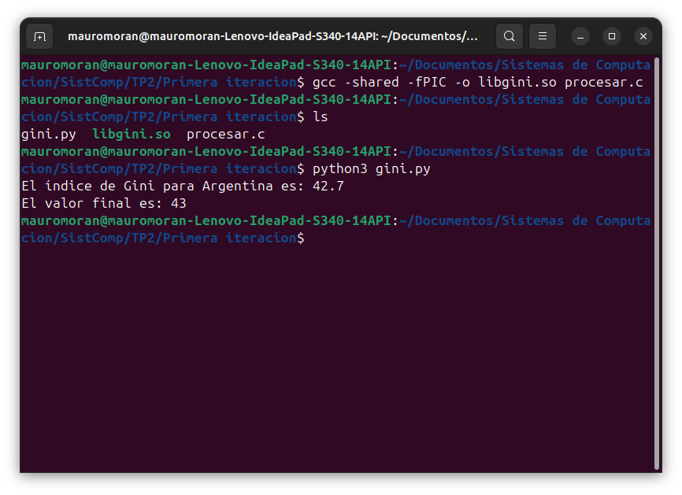
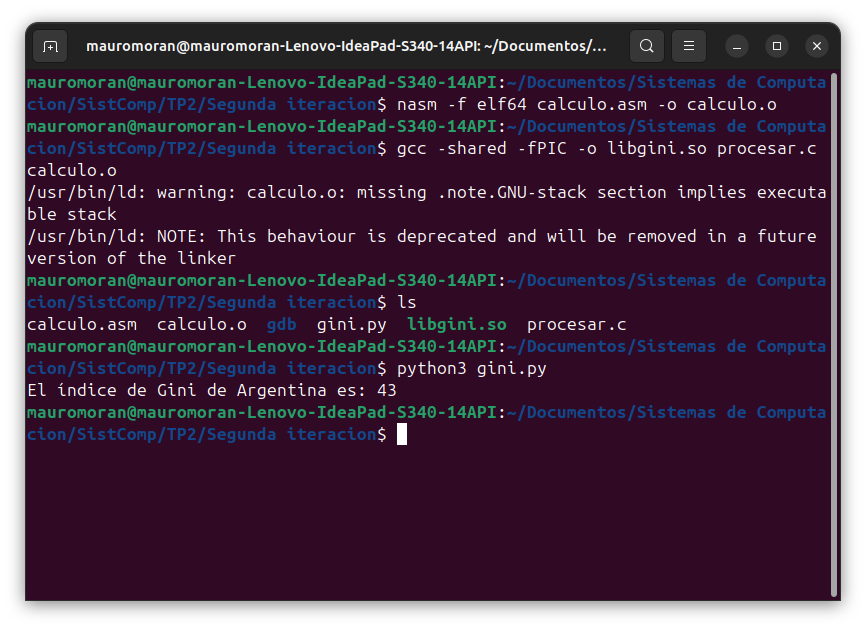
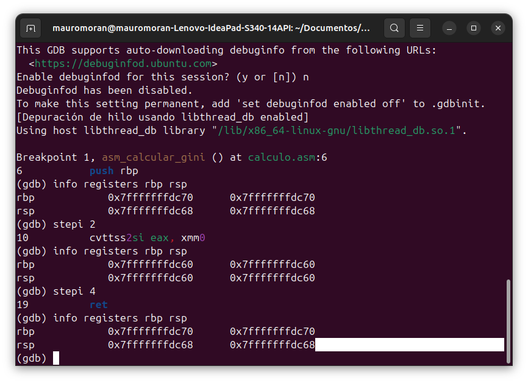

## 1. Introducción 
Los sistemas compuestos por hardware y software utilizan arquitecturas de capas para 
desarrollar aplicaciones complejas. En las capas superiores se trabaja con lenguajes de alto 
nivel, más "amigables" con el programador. En la capa inferior, más baja, siempre está el 
hardware puro y duro. Inmediatamente encima está la capa de lenguaje de bajo nivel, 
podríamos decir más amigable con el hardware. --- 
## 2. Primera Iteración 
En esta fase inicial, se resolvió la captura de datos y la comunicación entre lenguajes de alto 
nivel, sin intervención de ensamblador puro. 
### 2.1. Capa Superior (Python) 
Se implementó un script interactivo (gini.py) que actúa como interfaz principal con el usuario. 
Esta capa es responsable de: 
* Ejecutar una consulta directa y automatizada para Argentina. 
* Establecer comunicación mediante el protocolo HTTP (librería `requests`) con la API REST del 
Banco Mundial. 
* Extraer y validar el valor de punto flotante (float) correspondiente al último índice GINI 
registrado para Argentina. 
* Cargar dinámicamente la librería compartida de C utilizando ctypes, configurando 
estrictamente los tipos de datos de los argumentos (c_float) y el valor de retorno (c_int). 
### 2.2. Capa Intermedia (C) 
Se desarrolló un programa en C que funciona como puente. Durante esta iteración, la función en 
C recibió el parámetro flotante enviado por Python y simuló el procesamiento, devolviendo el 
resultado a la capa superior 
### 2.3. Guía de Ejecución (Paso a paso) 
Para poner en marcha esta iteración en la terminal: 
1. **Acceso:** `cd` a la carpeta de la primera iteración. 
2. **Compilación:** `gcc -shared -fPIC -o libgini.so calculo.c` (Generación de la librería 
compartida). 
3. **Verificación:** `ls` (Para confirmar la existencia de `gini.py`, `libgini.so` y `calculo.c`). 
4. **Ejecución:** `python3 gini.py` 
 --- 
## 3. Segunda Iteración 
En la etapa definitiva, la lógica de procesamiento fue delegada íntegramente al microprocesador 
utilizando lenguaje **Ensamblador**. 
### 3.1. Capa de Bajo Nivel (Assembler) 
Se implementó la rutina `asm_calcular_gini` en el archivo `calculo.asm`. La lógica se explica a 
continuación: 
* **Entrada de parámetros:** El valor flotante ingresa a través del registro vectorial `XMM0`. 
* **Conversión:** Se utiliza la instrucción `cvttss2si` para truncar el flotante y moverlo como 
entero de 32 bits al registro `EAX`. 
* **Procesamiento:** Se ejecuta `add eax, 1` para validar la modificación del dato en bajo nivel. 
* **Retorno:** El resultado final se mantiene en `EAX` para ser capturado por la capa de C. 
 --- 
## 4. Análisis de la Pila de Ejecución mediante GDB 
Para validar la integridad del sistema al intercalar lenguajes, se utilizó el depurador **GDB** 
analizando los registros **Base Pointer (RBP)** y **Stack Pointer (RSP)**. 
### 4.1. Estado Inicial de la Memoria 
Al pausar la ejecución en el ingreso a la rutina de ensamblador, la memoria refleja el marco 
perteneciente al `main` de C: 
* **RBP:** `0x7fffffffdc70` 
* **RSP:** `0x7fffffffdc68` 
El `RSP` se encuentra desplazado 8 bytes respecto a la base, espacio que contiene la dirección 
de retorno (`Return Address`) empujada por la instrucción `CALL`. 
### 4.2. Creación del Stack Frame 
Para asegurar un espacio de trabajo aislado 
1. `push rbp`: Resguarda el puntero base anterior (RSP desciende a `...dc60`). 
2. `mov rbp, rsp`: Iguala la base con el tope de la pila. 
* **Direcciones resultantes:** 
* **RBP:** `0x7fffffffdc60` 
* **RSP:** `0x7fffffffdc60` 
Ambos apuntan a la misma dirección, conformando el marco de pila local seguro para la función. 
### 4.3. Restauración de la Memoria (Epílogo) 
Finalizados los cálculos, es crítico restaurar la pila para devolver el control al sistema operativo: 
1. `mov rsp, rbp`: Restaura el puntero de la pila. 
2. `pop rbp`: Recupera el puntero base de la función llamadora. 
* **Direcciones finales:** 
* **RBP:** `0x7fffffffdc70` 
* **RSP:** `0x7fffffffdc68` 
Los valores coinciden exactamente con el Paso 1. La limpieza se realizó de forma impecable, 
permitiendo que `RET` devuelva el flujo a C de manera segura. 
