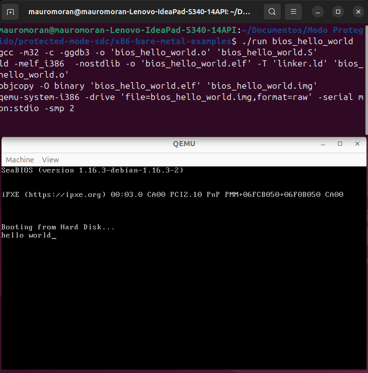
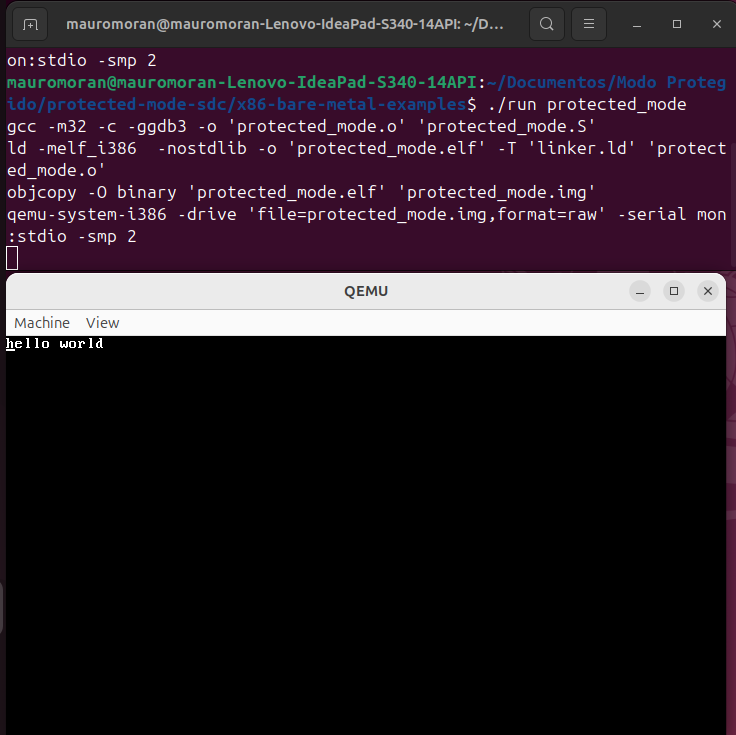
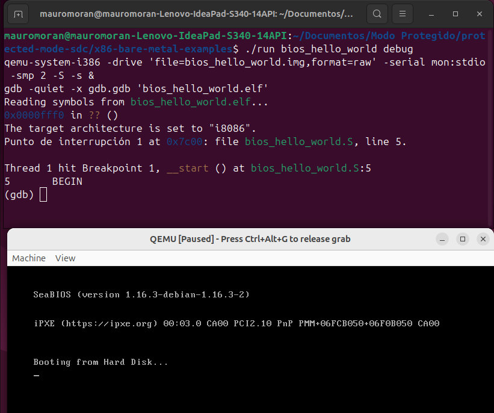
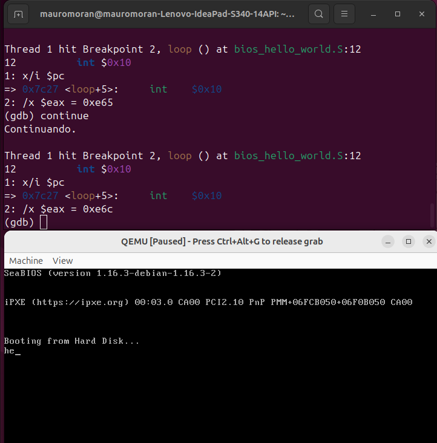

# Facultad de Ciencias Exactas Físicas y Naturales - UNC
# Sistemas de Computación

## TP3: Modo protegido

|Alumnos|
| :--- |
|Mora Ivan|
|Moran Mauro|

## 1. Introducción
Los procesadores x86 mantienen compatibilidad con sus antecesores. Al agregar nuevas funciones deben  “evolucionar” en el tiempo durante el proceso de arranque. Todos los CPUs x86 comienzan en modo real en el momento de carga (boot time) para asegurar compatibilidad hacia atrás, en cuanto se los energiza se comportan de manera muy primitiva. Luego mediante comandos se los hace evolucionar hasta poder obtener la máxima cantidad de prestaciones posibles.

El **modo protegido** es un modo operacional de los CPUs compatibles x86 de la serie 80286 y posteriores. Este modo es el primer salto evolutivo de los x86. Este modo nuevas características diseñadas para mejorar la multitarea y la estabilidad del sistema.

## 2. Desarrollo
### 2.1. UEFI
UEFI (Unified Extensible Firmware Interface) define un modelo moderno para la interfaz entre los sistemas operativos de las computadoras y el firmware del mismo. 
Esta especificación reemplaza a la BIOS tradicional basada en 16-bit Modo real x86 assembly, mientras que UEFI soporta x86, x64, ARM and Itanium.
Se utiliza durante el arranque del sistema utilizando las teclas **esc**, **F2**, **F12**, **del**, dependiendo del modelo de computadora utilizado.
Algunas de las funciones a las que se puede llamar desde el sistema operativo son:
* `GetTime()`: Retorna la fecha y hora actual, y las capacidades de gestión de tiempo.
* `SetTime()`: Setea la hora y fecha local.
* `GetVariable()`: Retorna el valor de la variable.
* `GetNextVariableName()`: Enumera el nombre de las variables actuales.
* `SetVariable()`: Setea el valor de una variable.
## 2.2. Bugs
Seguridad: Investigar bugs de UEFI y qué es el Intel CSME/MEBx.
Uno de de los problemas de seguridad se describe como `UEFIcanhazbufferoverflow`, el cual consiste en un desbordamiento de búfer que surge del uso de una variable insegura en la configuración del Módulo de Plataforma Confiable (TPM), lo que podría permitir la ejecución de código malicioso, afectando a dispositivos que usan el firmware Phoenix SecureCore.
## 2.3. Intel CSME
Es un subsistema dentro del chipset Intel que corre de manera independiente al procesador principal. Se encarga de funciones de **seguridad, gestión remota y arranque seguro**.
Opera incluso cuando la CPU está apagada, siempre que la máquina esté conectada a energía. Es responsable de tareas como autenticación, cifrado, control de firmware y soporte para Intel AMT (Active Management Technology).
## 2.4. Intel MEBx
Es la interfaz de configuración del **Intel Management Engine** accesible durante el arranque. Permite al administrador configurar opciones de Intel AMT, contraseñas, parámetros de red y políticas de seguridad.

Se accede normalmente presionando una combinación de teclas (**Ctrl+P**) durante el POST, antes de que cargue el sistema operativo.
Funciona como un “e.mini BIOS” dedicado a la gestión remota y empresarial.
## 2.4. Coreboot
`Coreboot` fue creado en un principio para arrancar sistemas operativos con núcleo Linux.
Es un proyecto dirigido a reemplazar el firmware no libre de los BIOS propietarios, encontrados en la mayoría de los computadores, por un BIOS libre y ligero diseñado para realizar solamente el mínimo de tareas necesarias para cargar y correr un sistema operativo moderno de 32 bits o de 64 bits.

## 3.1. Linker y generador de imágenes binarias
El linker es una herramienta que agarra archivos objeto (.o) que vienen del ensamblador o del compilador y los junta en un solo ejecutable, o en una imagen
binaria.

En un linker script aparecen las siguientes instrucciones: 

```Id
SECTIONS {
    .=0x7C00;
    .text : { *(.text)}
    .data : { *(.data)}
    .bss : {*(.bss)}
}
```
Donde `.=0x7C00` es el location counter, quien avisa al linker que el código corre a partir de esa dirección. 

## 3.2. Prueba de imágen con QEMU
El código base fue proporcionado por la cátedra en un repositorio. 

En primera instancia se trabajó con código a muy bajo nivel diseñado para ejecutarse directamente sobre el hardware sin la intervención de un sistema operativo. 

Se utilizó el emulador QEMU para simular el compartamiento de una computadora.



Un segundo ejemplo se muestra a continuación:


Posteriormente, con GDB se inspeccionó el estado del procesador en tiempo real. Al iniciar la conexión con el emulador, la ejecución se detuvo automáticamente en la dirección física `0x7C00`, confirmando que la BIOS cargó correctamente el sector de arranque en memoria.



Para observar las modificaciones directas en los registros internos del sistema, se configuró la visualización continua del puntero de instrucción y del registro acumulador (`EAX`). Luego, se estableció un *breakpoint* en la dirección `0x7C27`, correspondiente a la instrucción `int 0x10` (llamada a la interrupción de video de la BIOS). 



Al continuar la ejecución iterativa del bucle, se evitó ingresar paso a paso en las subrutinas internas de la placa madre. Esto permitió observar de forma limpia cómo se cargaba secuencialmente con los valores hexadecimales de cada carácter de la cadena (por ejemplo, `0x68` para la letra 'h') justo antes de ejecutar la interrupción para imprimirlo en la pantalla.

## 3.3. Ejecución en Hardware Real

Como última etapa del laboratorio, se procedió a preparar un dispositivo USB físico para intentar la ejecución fuera del entorno emulado. Para ello, se identificó el pendrive en el sistema y se utilizó el comando `dd`, el cual permitió transferir la imagen binaria exacta a los primeros 512 bytes (el sector de arranque) del dispositivo, sobrescribiendo su tabla de particiones original:

```bash
sudo dd if=protected_mode.img of=/dev/sdb
```
Sin embargo, la ejecución en el hardware real fue frenada por las restricciones de la arquitectura del equipo. La placa base opera bajo el estándar UEFI (Unified Extensible Firmware Interface) y mantiene activa la política de seguridad Secure Boot. 

Dado que la imagen generada es un código ensamblador primitivo diseñado para el esquema de arranque clásico (MBR/Legacy) y carece de firmas digitales, el UEFI bloquea su carga en la memoria. Al denegar el acceso a este código no firmado, la secuencia de arranque ignora el dispositivo USB y delega el control automáticamente al gestor de arranque principal (Windows).